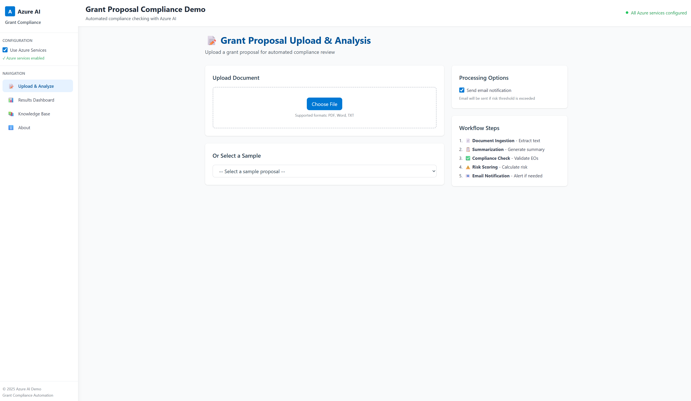

# Grant Proposal Compliance Automation with Azure AI Foundry

> **Automating grant proposal review for executive order compliance using Azure AI Foundry, reducing manual review time while maintaining legal oversight.**



More images can be found at [images directory](images/).

---

## ⚠️ IMPORTANT: DEMONSTRATION PURPOSES ONLY

**This repository is a demonstration/proof-of-concept and is NOT intended for production workloads.**

Before deploying to production, you must address:

### 🔐 Security Requirements
- Implement proper authentication and authorization (Azure AD, RBAC)
- Enable encryption at rest and in transit for all data
- Secure all secrets using Azure Key Vault (no hardcoded credentials)
- Implement network security with Private Endpoints and VNets
- Enable Azure AD Managed Identity for service-to-service authentication
- Conduct security review and penetration testing

### 🏗️ Architecture & Governance
- Follow [Azure Well-Architected Framework](https://learn.microsoft.com/azure/well-architected/) principles
- Implement proper resource tagging and naming conventions
- Set up Azure Policy for governance and compliance
- Configure disaster recovery and business continuity plans
- Implement proper logging, monitoring, and alerting (Azure Monitor, Application Insights)

### 💰 Cost Management
- Right-size all resources based on actual workload requirements
- Implement Azure Cost Management and budgets
- Use Reserved Instances or Savings Plans where applicable
- Set up cost alerts and regular cost reviews
- Consider Azure Advisor recommendations for cost optimization

### 🛡️ Reliability & Performance
- Implement high availability with multiple regions/zones
- Set up automated backups and test restore procedures
- Configure auto-scaling for variable workloads
- Perform load testing and capacity planning
- Implement proper error handling and retry logic

### 📋 Compliance & Legal
- Ensure compliance with data residency requirements
- Implement data retention and deletion policies
- Obtain legal review for AI-generated content use
- Establish human-in-the-loop validation workflows
- Document data processing activities (GDPR, privacy laws)

**Recommended Next Steps:**
1. Review [Azure Landing Zones](https://learn.microsoft.com/azure/cloud-adoption-framework/ready/landing-zone/) and [Aure AI Landing Zones](https://github.com/Azure/AI-Landing-Zones) for enterprise deployment
2. Implement [Azure Security Baseline](https://learn.microsoft.com/security/benchmark/azure/)
3. Follow [AI Responsible AI Standard](https://www.microsoft.com/ai/responsible-ai)
4. Engage Azure Architecture Center for [reference architectures](https://learn.microsoft.com/azure/architecture/)

---

## Table of Contents
- [Overview](#overview)
- [Use Case](#use-case)
- [Solution Architecture](#solution-architecture)
- [Key Features](#key-features)
- [Products Used](#products-used)
- [Prerequisites](#prerequisites)
- [Getting Started](#getting-started)
- [Demo Application](#demo-application)
- [Deployment](#deployment)
- [Project Structure](#project-structure)
- [Contributing](#contributing)
- [Resources](#resources)

## Overview

This solution accelerator demonstrates how to automate the review of grant proposals for compliance with executive orders using Azure AI services. The system reduces manual attorney workload while ensuring legal accuracy through human-in-the-loop validation.

**Problem**: County departments manually email grant proposals to legal offices for compliance review against executive orders—a time-consuming process prone to delays.

**Solution**: An AI-powered document analysis system that automatically extracts, indexes, and analyzes grant proposals against a knowledge base of executive orders, providing attorneys with structured compliance summaries for validation.

## Use Case

### Customer Scenario
Currently, county departments submit grant proposals and related documents via email to the legal office. Attorneys must manually review each document for compliance with relevant executive orders before responding to clients. This manual process is:
- **Time-intensive**: Each proposal requires careful analysis
- **Resource-heavy**: Attorneys spend significant time on repetitive compliance checks
- **Delay-prone**: Manual processes create bottlenecks

### Target Users
- **Legal Departments**: County/municipal legal offices handling grant proposal reviews
- **Government Agencies**: Departments submitting grant proposals requiring compliance validation
- **Attorneys**: Legal professionals providing compliance oversight and final validation

## Solution Architecture

```
┌─────────────────┐
│   Document      │
│   Submission    │
│ (Email/Forms)   │
└────────┬────────┘
         │
         ▼
┌─────────────────┐
│   SharePoint    │
│   Storage       │
└────────┬────────┘
         │
         ▼
┌─────────────────────────────────────────────────────┐
│         Azure AI Foundry Processing                 │
│  ┌──────────────────┐    ┌──────────────────┐     │
│  │   Document       │    │   Azure AI       │     │
│  │   Intelligence   │───▶│   Search         │     │
│  │   (OCR/Extract)  │    │   (Semantic)     │     │
│  └──────────────────┘    └──────────────────┘     │
│                                                     │
│  ┌──────────────────────────────────────────┐     │
│  │   Compliance Agent                       │     │
│  │   - Query knowledge base                 │     │
│  │   - Generate compliance summary          │     │
│  │   - Provide structured citations         │     │
│  └──────────────────────────────────────────┘     │
└────────────────────────┬────────────────────────────┘
                         │
                         ▼
                 ┌───────────────┐
                 │ Azure Function│
                 │ Apps (Email)  │
                 └───────┬───────┘
                         │
                         ▼
                 ┌───────────────┐
                 │   Attorney    │
                 │   Review &    │
                 │   Validation  │
                 └───────┬───────┘
                         │
                         ▼
                 ┌───────────────┐
                 │   Client      │
                 │   Notification│
                 └───────────────┘
```

## Key Features

### 🤖 **AI-Powered Document Analysis**
- Automated OCR and content extraction using Azure Document Intelligence
- Semantic search against executive order knowledge base
- Structured compliance summaries with confidence scores

### 📚 **Knowledge Base Integration**
- Curated repository of executive orders and grant compliance rules
- Local and cloud-based document access for demo flexibility
- Semantic indexing with Azure AI Search for accurate retrieval
- **Optional SharePoint integration** for enterprise document management

### 🔔 **Intelligent Notification System**
- Azure Function Apps trigger attorney notifications
- Email includes document links, AI analysis, and confidence scores
- Prioritization based on complexity and confidence levels

### 👨‍⚖️ **Human-in-the-Loop Validation**
- All AI-generated analyses require attorney review
- Structured format facilitates quick validation
- Attorneys can approve, modify, or reject AI recommendations

### 📊 **Continuous Improvement**
- Prompt engineering tracked in Azure AI Foundry
- Output evaluation and iterative refinement
- Feedback loop for improved accuracy over time

## Scoring System

The system uses three complementary scores to evaluate grant proposals and guide decision-making:

### 1. **Confidence Score** (0-100)
- **Purpose**: Measures how certain the AI is about its compliance analysis
- **Source**: Generated by ComplianceAgent during executive order analysis
- **Interpretation**:
  - **90-100** (Very High): AI is very certain—proceed with standard review
  - **70-89** (High): Generally reliable—may need minor clarification
  - **50-69** (Moderate): Significant uncertainty—prioritize manual review
  - **<50** (Low): Unreliable—require immediate expert review
- **Decision Impact**: Low confidence (<60%) increases risk score and triggers priority attorney review

### 2. **Compliance Score** (0-100)
- **Purpose**: Measures alignment with executive order requirements
- **Source**: Currently uses confidence_score as a proxy; represents AI's assessment of compliance
- **Interpretation**:
  - **90-100** (Excellent): Fully compliant with all applicable executive orders
  - **70-89** (Good): Generally compliant with minor clarifications needed
  - **50-69** (Fair): Partial compliance with concerns requiring attention
  - **<50** (Poor): Significant compliance issues identified
- **Decision Impact**: Primary factor in risk calculation (60% weight)

### 3. **Risk Score** (0-100)
- **Purpose**: Composite score measuring overall proposal risk
- **Source**: Calculated by RiskScoringAgent using weighted formula
- **Calculation**: `Risk = (Compliance × 60%) + (Quality × 25%) + (Completeness × 15%)`
- **Interpretation**:
  - **90-100** (Low Risk): Approve
  - **75-89** (Medium Risk): Recommend approval with minor revisions
  - **60-74** (Medium-High Risk): Approve with major revisions required
  - **<60** (High Risk): Recommend rejection or major rework
- **Decision Impact**: Final determination for approval workflow

### Why This Scoring Approach?

**Three-Dimensional Assessment**: Separating confidence (AI certainty), compliance (regulatory alignment), and risk (overall assessment) provides clarity at each decision point.

**Conservative Bias**: The 60% weighting on compliance ensures legal/regulatory concerns are prioritized—appropriate for government context where compliance failures have serious consequences.

**Actionable Thresholds**: Clear score ranges (90, 75, 60) map directly to approval actions, making decisions straightforward for attorneys and submitters.

**For complete scoring documentation**, see [docs/ScoringSystem.md](docs/ScoringSystem.md).

## Products Used

### Core Azure Services

| Service | Purpose | Key Features |
|---------|---------|--------------|
| **Azure AI Foundry** | AI orchestration and agent management | Prompt flow design, agent orchestration, evaluation tracking |
| **Azure Document Intelligence** | Document processing and extraction | OCR, form recognition, layout analysis, content extraction |
| **Azure AI Search** | Semantic search and retrieval | Vector search, semantic ranking, knowledge base indexing |
| **Azure Blob Storage** | Document storage and management | Scalable storage, file organization, integration with processing services |
| **Azure Function Apps** | Serverless notifications and workflows | Email triggers, event-driven processing, scalable execution |
| **SharePoint** | Document storage and management | Centralized document repository, access control |
| **Azure Key Vault** | Secrets management | Secure credential storage, managed identity integration |
| **Azure Monitor** | Logging and monitoring | Application insights, performance tracking |

### Optional Azure Services

| Service | Purpose | Use Case |
|---------|---------|----------|
| **Azure Container Registry** | Container image management | Store and manage Docker container images for deployment |
| **Azure App Service** | Web application hosting | Host Streamlit or FastAPI applications in production |
| **Azure Queue Storage** | Asynchronous message queue | Queue document processing jobs, decouple workflows |
| **SharePoint Online** | Document management (optional) | Store and access grant proposals and executive orders in SharePoint |

### AI & ML Services

- **Azure OpenAI Service**: Large language models for compliance analysis
- **Microsoft Agent Framework**: Agent orchestration and workflow management
- **Semantic Kernel**: AI plugin ecosystem and function calling

### Development Tools

- **Streamlit**: Interactive demo application
- **Python**: Primary development language
- **Microsoft Agent Framework**: Agent development SDK

## Agent Customization

Each agent in the `/agents` folder is fully customizable to adapt to your specific compliance requirements:

### What You Can Customize

**Prompts & Instructions**
- System prompts that define agent behavior and tone
- Task-specific instructions for analysis depth
- Example: Modify `compliance_agent.py` to emphasize specific regulatory frameworks

**Text Processing**
- Preprocessing pipelines (cleaning, normalization, formatting)
- Token truncation limits for context management
- Example: Adjust `max_tokens=4000` in `summarization_agent.py` for longer/shorter summaries

**Integration Points**
- Custom ML models for specialized classification
- Third-party APIs for domain-specific analysis
- Azure Cognitive Services for enhanced capabilities
- Example: Add sentiment analysis to `risk_scoring_agent.py` using Azure Text Analytics

**Scoring & Logic**
- Risk calculation formulas and weights
- Confidence thresholds and escalation rules
- Example: Modify compliance weight from 60% to 70% in `risk_scoring_agent.py`

### Customization Examples

```python
# agents/compliance_agent.py - Custom prompt
system_prompt = """
You are a legal compliance expert specializing in environmental regulations.
Focus on: Clean Air Act, Clean Water Act, and state-specific environmental orders.
Provide citations to specific CFR sections when applicable.
"""

# agents/summarization_agent.py - Text truncation
max_input_tokens = 8000  # Increase for longer documents
max_output_tokens = 1000  # Adjust summary length

# agents/risk_scoring_agent.py - Custom ML integration
from azure.ai.textanalytics import TextAnalyticsClient
sentiment_score = text_analytics_client.analyze_sentiment(document_text)
risk_factors.append({"factor": "negative_sentiment", "weight": 0.1})
```

### Critical: Document Ingestion & Summarization Customization

⚠️ **The Document Ingestion and Summarization agents are foundational to the entire workflow.** These agents determine what information is extracted from PDFs and how it's structured—directly impacting downstream compliance analysis, risk scoring, and citation accuracy.

**Why Customization Matters:**
- **Complex PDF Variability**: Grant proposals vary widely in structure, formatting, and content organization
- **Downstream Dependencies**: Compliance and risk agents rely on the quality and completeness of extracted information
- **Garbage In, Garbage Out**: Poor document extraction leads to missed compliance requirements, inaccurate citations, and unreliable risk scores

**What You Should Review & Customize:**

**Document Structure Extraction**
- Which sections are critical? (Budget, Timeline, Scope, Objectives, Compliance Statements)
- How are sections identified? (Headers, page breaks, table of contents)
- Example: Configure `document_ingestion_agent.py` to prioritize "Compliance Plan" and "Budget Narrative" sections

**Content Processing Requirements**
- Do you need tables extracted? (Budget tables, staffing plans, performance metrics)
- Are images/charts important? (Project diagrams, site maps, organizational charts)
- Should form fields be preserved? (Standard grant application forms)
- Example: Enable table extraction in Azure Document Intelligence: `features=["tables", "keyValuePairs"]`

**Text Extraction Strategies**
- OCR quality settings for scanned documents (DPI, language detection)
- Layout preservation vs. pure text extraction
- Handling multi-column formats, footnotes, headers/footers
- Example: Adjust `read_order="natural"` in Document Intelligence for logical reading flow

**Summarization Focus**
- Which content should summaries emphasize? (Compliance statements, budget, deliverables)
- What level of detail? (High-level overview vs. section-by-section breakdown)
- Should original citations be preserved in summaries?
- Example: Modify `summarization_agent.py` prompt to highlight compliance-related text:
  ```python
  summary_prompt = """
  Summarize this grant proposal with emphasis on:
  1. Explicit compliance statements and executive order references
  2. Budget allocation and timeline commitments
  3. Measurable outcomes and performance metrics
  Preserve exact phrases related to legal/regulatory compliance.
  """
  ```

**Impact on Downstream Workflow:**
- **Compliance Agent**: Relies on extracted compliance statements and section structure
- **Risk Scoring Agent**: Uses budget data, timeline information, and completeness metrics
- **Citation Display**: Depends on accurate section identification and text mapping
- **Email Notifications**: Includes summary content and key extracted information

**Recommended Approach:**
1. **Analyze Sample Documents**: Review 5-10 representative grant proposals to identify patterns
2. **Define Extraction Requirements**: Document which sections, tables, and content types are essential
3. **Configure Document Intelligence**: Adjust OCR and extraction settings based on document types
4. **Test Extraction Quality**: Validate that critical information is captured accurately
5. **Iterate Summarization**: Refine prompts to produce summaries that support downstream analysis
6. **Measure Impact**: Evaluate how extraction changes affect compliance accuracy and risk scores

### Best Practices

- **Version Control**: Track prompt changes in git for A/B testing
- **Evaluation**: Use Azure AI Foundry evaluation tools to measure impact
- **Documentation**: Comment custom logic thoroughly for team collaboration
- **Testing**: Test agents individually before orchestrator integration

For detailed agent architecture, see [docs/Architecture.md](docs/Architecture.md).

## Prerequisites

### Azure Resources

#### Required Resources
- Azure subscription with appropriate permissions
- Azure AI Foundry project and workspace
- Azure AI Search service
- Azure Document Intelligence resource
- Azure Blob Storage (for document storage and processing)
- Azure Function App (for production deployment)
- SharePoint Online (optional - for enterprise document management)

#### Optional Resources
- Azure Container Registry (for containerized deployments)
- Azure App Service (for hosting web applications)
- Azure Queue Storage (for asynchronous processing workflows)

### Development Environment
- Python 3.10 or higher
- Azure CLI installed and configured
- Visual Studio Code (recommended)
- Git

### Knowledge & Skills
- Basic understanding of Azure services
- Python programming
- Document processing concepts
- AI/ML fundamentals (helpful but not required)

## Getting Started

### Quick Start (One Command)

Start both backend and frontend with a single command:

**Linux/Mac:**
```bash
./start.sh
```

This will:
- ✅ Check prerequisites (Python, Node.js, npm)
- ✅ Install all dependencies automatically
- ✅ Start FastAPI backend on port 8000
- ✅ Start React frontend on port 3000
- ✅ Open browser automatically

**To stop services:**
```bash
./stop.sh    # Linux/Mac
```

---

### Manual Setup (Step-by-Step)

#### 1. Clone the Repository

```bash
git clone https://github.com/your-org/foundry-grant-eo-validation-demo.git
cd foundry-grant-eo-validation-demo
```

#### 2. Install Dependencies

```bash
python -m venv .venv
source .venv/bin/activate  # On Windows: .venv\Scripts\activate

# Install Python dependencies (use --pre flag for Agent Framework preview)
pip install -r requirements.txt

# Install Agent Framework with Azure AI support (preview)
pip install agent-framework-azure-ai --pre
```

> **Note**: The `--pre` flag is required while Agent Framework is in preview.

### 3. Configure Environment

Create a `.env` file from the template:

```bash
cp .env.example .env
```

Update `.env` with your Azure credentials:

```env
# Azure AI Foundry
AZURE_AI_PROJECT_CONNECTION_STRING=your_connection_string
AZURE_OPENAI_ENDPOINT=https://your-resource.openai.azure.com/
AZURE_OPENAI_API_VERSION=2024-10-01-preview
AZURE_OPENAI_DEPLOYMENT_NAME=gpt-4

# Azure AI Search
AZURE_SEARCH_ENDPOINT=https://your-search-service.search.windows.net
AZURE_SEARCH_INDEX_NAME=grant-compliance-index

# Azure Document Intelligence
AZURE_DOCUMENT_INTELLIGENCE_ENDPOINT=https://your-region.api.cognitive.microsoft.com

# Use Managed Identity (recommended for production)
USE_MANAGED_IDENTITY=true
```

### 4. Add Your PDF Documents

#### Uploading PDFs to Azure AI Search Knowledge Base

For production use with semantic search capabilities:

**Quick Steps**:
1. Place PDF executive orders in `knowledge_base/executive_orders/`
2. Configure Azure credentials in `.env` file
3. Run the indexing script:
   ```bash
   python scripts/index_knowledge_base.py --input knowledge_base/executive_orders
   ```

**📤 [Complete Upload Instructions](docs/uploadPdfsToAzureSearch.md)** - Detailed step-by-step guide  
**⚡ [Quick Upload Reference](docs/pdfQuickReference.md)** - 3-step quick reference card

#### Adding Knowledge Base Documents (Executive Orders)

Place your PDF executive orders in the knowledge base directory:

```bash
# Copy your executive order PDFs
cp /path/to/your/executive_order.pdf knowledge_base/executive_orders/
cp /path/to/your/executive_order.pdf knowledge_base/sample_executive_orders/

# Example structure:
# knowledge_base/executive_orders/
#   ├── EO_14008_Climate_Crisis.pdf
#   ├── EO_14028_Cybersecurity.pdf
#   ├── EO_13985_Racial_Equity.pdf
#   └── your_executive_order.pdf
```

#### Adding Grant Proposals for Review

Place PDF grant proposals that need validation:

```bash
# Copy grant proposal PDFs to sample proposals directory
cp /path/to/your/grant_proposal.pdf knowledge_base/sample_proposals/

# Example structure:
# knowledge_base/sample_proposals/
#   ├── affordable_housing_grant.pdf
#   ├── education_program_grant.pdf
#   └── your_grant_proposal.pdf
```

**Note**: In the demo mode, you can also upload PDFs directly through the Streamlit interface. For production deployment with Azure Document Intelligence, PDFs will be automatically processed for OCR and text extraction.

#### PDF Document Processing

For production use with Azure services:

1. **Index Knowledge Base PDFs** (Executive Orders)
   ```bash
   # Run indexing script to process PDFs and upload to Azure AI Search
   python scripts/index_knowledge_base.py --input knowledge_base/executive_orders/
   ```

2. **Process Grant Proposal PDFs** (Documents for Review)
   - Upload through Streamlit interface, OR
   - Place in SharePoint document library (production setup), OR
   - Submit via email (triggers Azure Function App)

The Azure Document Intelligence service will automatically:
- Perform OCR on scanned documents
- Extract text with layout preservation
- Identify form fields and tables
- Extract metadata (dates, document types, etc.)

### 5. Run the Application

**React Frontend + FastAPI Backend (Recommended):**
```bash
# Start both frontend and backend with one command
./start.sh

# Or manually:
# Terminal 1 - Backend
cd backend
python main.py

# Terminal 2 - Frontend
cd frontend
npm install
npm run dev
```

The React app will open at `http://localhost:3000` with backend API at `http://localhost:8000`.

**Alternative: Streamlit Demo (Legacy):**
```bash
# Run standalone Streamlit demo
streamlit run app/streamlit_app_new.py
```

The Streamlit app will open at `http://localhost:8501`.

## Demo Application

The application provides both a modern React frontend and a legacy Streamlit interface:

### React Frontend (Recommended)
Modern, production-ready interface with:
- **Document Upload**: Drag-and-drop for grant proposals (PDF, Word, text)
- **Real-time Processing**: Watch multi-agent analysis in action
- **Compliance Dashboard**: Visual compliance status with detailed citations
- **Knowledge Base**: Browse and download executive orders
- **Risk Analysis**: Comprehensive risk scoring with recommendations

### Streamlit Demo (Legacy)
Original demo interface available at `app/streamlit_app_new.py` for reference.

### Working with PDF Documents

#### Upload PDF Grant Proposals
1. Navigate to "📝 Document Upload" page
2. Use the file uploader to select your PDF
3. In demo mode: Text preview will be shown (full OCR requires Azure Document Intelligence)
4. Click "🚀 Analyze for Compliance" to process

#### PDF Knowledge Base Documents
- PDF executive orders in `knowledge_base/executive_orders/` are used for compliance checking
- In production mode, these are indexed in Azure AI Search with full text extraction
- Demo mode uses pre-extracted text versions for immediate testing

#### Production PDF Processing
When connected to Azure Document Intelligence:
- **Automatic OCR**: Scanned documents are converted to searchable text
- **Layout Analysis**: Document structure (headings, sections, tables) is preserved
- **Form Recognition**: Key-value pairs and form fields are extracted
- **Metadata Extraction**: Document properties (dates, authors, types) are identified

**File Size Limits**:
- Demo upload: Up to 10MB per file
- Azure Document Intelligence: Up to 500MB per file
- Batch processing: Multiple documents can be queued

**Supported PDF Types**:
- ✅ Text-based PDFs (native digital documents)
- ✅ Scanned PDFs (OCR automatically applied)
- ✅ Mixed content PDFs (text + images)
- ✅ Form-based PDFs (AcroForms, fillable PDFs)

## Deployment

### Local Development
Follow the [Getting Started](#getting-started) steps above.

### Azure Deployment

1. **Provision Azure Resources**
   ```bash
   # Use Azure CLI or provided ARM/Bicep templates
   az deployment group create \
     --resource-group your-rg \
     --template-file deployment/main.bicep
   ```

2. **Deploy Function Apps**
   ```bash
   cd functions
   func azure functionapp publish your-function-app-name
   ```

3. **Configure SharePoint Integration**
   - Set up document library
   - Configure webhooks for document submission
   - Grant necessary permissions

4. **Deploy AI Agents**
   - Deploy agents to Azure AI Foundry
   - Configure prompts and workflows
   - Set up evaluation pipelines

Detailed deployment instructions are available in [Deployment.md](docs/Deployment.md).

## Project Structure

```
foundry-grant-eo-validation-demo/
├── frontend/                      # React + TypeScript UI (Primary)
│   ├── src/
│   │   ├── pages/                 # React pages (About, Upload, Results, Knowledge Base)
│   │   └── components/            # Reusable UI components
│   └── package.json               # Frontend dependencies
├── backend/
│   ├── main.py                    # FastAPI REST API
│   └── requirements.txt           # Backend dependencies
├── app/
│   ├── streamlit_app_new.py       # Streamlit demo (Legacy)
│   ├── components/                # Streamlit UI components
│   └── utils/                     # Helper functions
├── agents/
│   ├── orchestrator.py            # Main orchestration agent
│   ├── compliance_agent.py        # Compliance checking agent
│   ├── document_ingestion_agent.py # Document processing agent
│   ├── summarization_agent.py     # Summary generation agent
│   ├── risk_scoring_agent.py      # Risk assessment agent
│   ├── email_trigger_agent.py     # Email notification agent
│   └── config/                    # Agent configurations
├── knowledge_base/
│   ├── executive_orders/          # 📄 Place executive order PDFs here
│   │   ├── EO_14008_Climate_Crisis.txt
│   │   ├── EO_14028_Cybersecurity.txt
│   │   ├── EO_13985_Racial_Equity.txt
    ├── sample_executive_orders/          # 📄 Place executive order PDFs here
│   │   ├── EO_14008_Climate_Crisis.txt
│   │   ├── EO_14028_Cybersecurity.txt
│   │   ├── EO_13985_Racial_Equity.txt
│   │   └── *.pdf                  # Your PDF executive orders
│   ├── grant_guidelines/          # Grant compliance rules
│   │   └── *.txt, *.pdf           # Policy documents
│   └── sample_proposals/          # 📄 Place grant proposal PDFs here
│       └── *.pdf                  # Your grant proposals to review
├── functions/
│   ├── email_notifier/            # Azure Function for email notifications
│   └── document_processor/        # Azure Function for document ingestion
├── config/
│   ├── search_index.json          # Azure AI Search index definition
│   └── document_intelligence.json # Document Intelligence config
├── deployment/
│   ├── main.bicep                 # Infrastructure as Code
│   └── parameters.json            # Deployment parameters
├── docs/
│   ├── Architecture.md            # Detailed architecture documentation
│   ├── Deployment.md              # Deployment guide
│   └── UserGuide.md               # End-user documentation
├── tests/
│   ├── test_agents.py             # Agent unit tests
│   └── test_integration.py        # Integration tests
├── scripts/
│   ├── index_knowledge_base.py    # Index PDFs to Azure AI Search
│   ├── process_documents.py       # Batch process PDFs with Document Intelligence
│   └── sharepoint_integration.py  # Optional: SharePoint document access
├── .env.example                   # Environment variables template
├── requirements.txt               # Python dependencies
├── pyproject.toml                 # Project configuration
└── README.md                      # This file
```

### Document Organization

**Knowledge Base PDFs** (`knowledge_base/executive_orders/` or `knowledge_base/sample_executive_orders/`):
- Place all executive order PDFs here
- These documents form the compliance reference library
- Indexed in Azure AI Search for semantic retrieval
- Used by AI agents to validate grant proposals

**Grant Proposal PDFs** (`knowledge_base/sample_proposals/`):
- Place grant proposals that need compliance review
- Can be uploaded through Streamlit UI or placed directly
- Processed by Azure Document Intelligence for text extraction
- Analyzed against knowledge base for compliance

**Best Practices for PDF Organization**:
- Use descriptive filenames (e.g., `EO_14008_Climate_Action.pdf`)
- Include document metadata in filename when possible
- Keep original PDFs in their native format
- Store text-extracted versions separately for faster demo mode

## Contributing

This project welcomes contributions and suggestions. Please see [CONTRIBUTING.md](CONTRIBUTING.md) for guidelines.

## Resources

### Documentation
- [Azure AI Foundry Documentation](https://learn.microsoft.com/azure/ai-studio/)
- [Azure Document Intelligence](https://learn.microsoft.com/azure/ai-services/document-intelligence/)
- [Azure AI Search](https://learn.microsoft.com/azure/search/)
- [Microsoft Agent Framework](https://github.com/microsoft/agent-framework)

### Project Guides
- [⚛️ React App Quick Start](docs/ReactQuickstart.md) - **Get the React frontend running in 60 seconds**
- [🏗️ System Architecture](docs/Architecture.md) - **Comprehensive architecture documentation**
- [🚀 Deployment Guide](docs/Deployment.md) - **Azure deployment instructions**
- [📖 User Guide](docs/UserGuide.md) - **End-user documentation and workflows**
- [📤 Upload PDFs to Azure AI Search](docs/uploadPdfsToAzureSearch.md) - Step-by-step guide for indexing PDF documents
- [📄 PDF Document Guide](docs/pdfGuide.md) - Working with PDF executive orders and proposals
- [⚡ PDF Quick Reference](docs/pdfQuickReference.md) - One-page PDF command reference
- [📁 SharePoint Integration (Optional)](docs/sharepointIntegration.md) - Access documents from SharePoint
- [⚡ SharePoint Quick Start](docs/sharepointQuickstart.md) - Quick SharePoint setup guide
- [🔄 Compliance Workflow](docs/ComplianceWorkflowDiagram.md) - Visual workflow diagram
- [📊 Scoring System](docs/ScoringSystem.md) - Understanding confidence, compliance, and risk scores

### Related Solution Accelerators
- [Document Knowledge Mining Solution Accelerator](https://github.com/microsoft/Document-Knowledge-Mining-Solution-Accelerator)
- [Azure AI Search OpenAI Demo](https://github.com/Azure-Samples/azure-search-openai-demo)

### Support
For questions or issues, please open an issue in this repository or contact the development team.

---

**License**: MIT  
**Maintainer**: Your Organization  
**Last Updated**: November 2025
