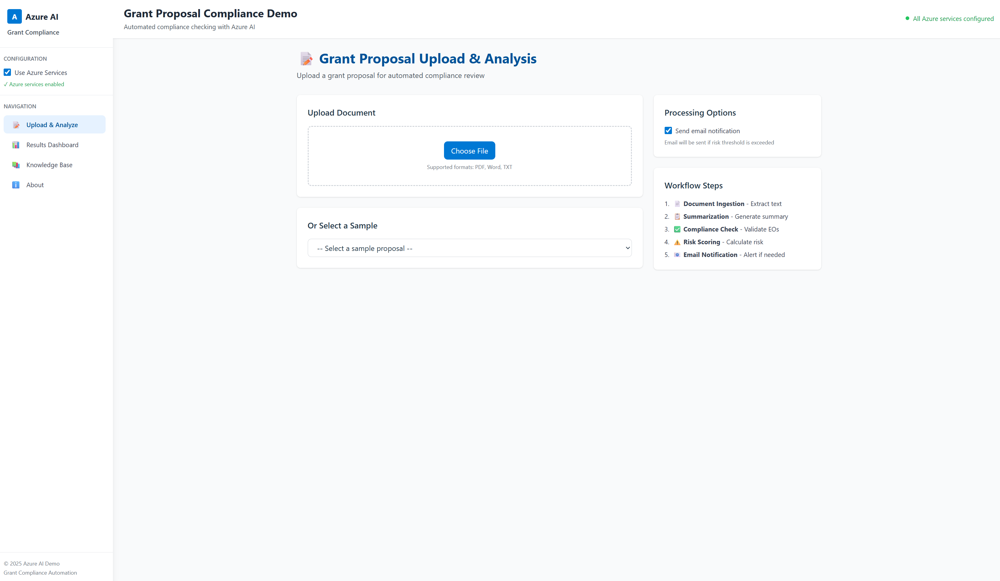
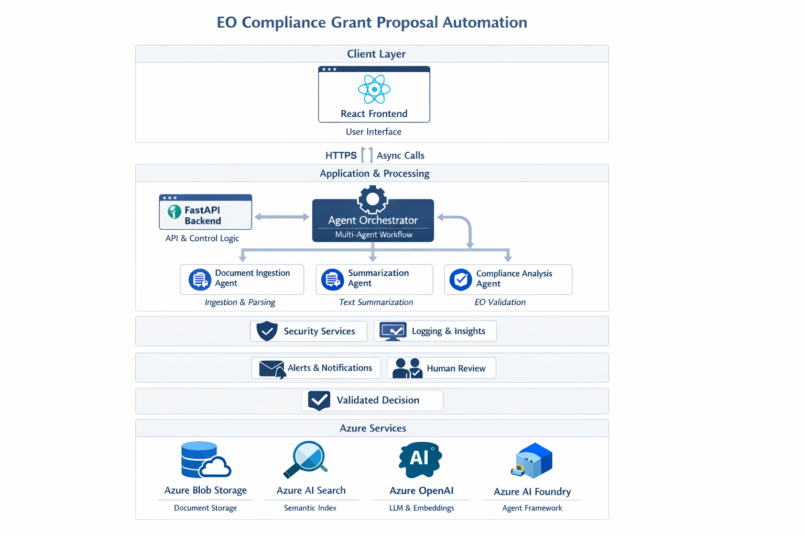

# Grant Proposal Compliance Automation with Azure AI Foundry

> **Automating grant proposal review for executive order compliance using Azure AI Foundry, reducing manual review time while maintaining legal oversight.**



> **⚠️ DEMONSTRATION ONLY** — This is a proof-of-concept, not production-ready. Before production use, address security (Azure AD, Key Vault, Private Endpoints), governance ([Well-Architected Framework](https://learn.microsoft.com/azure/well-architected/)), cost management, reliability, and compliance requirements. See [Azure Landing Zones](https://learn.microsoft.com/azure/cloud-adoption-framework/ready/landing-zone/) and [Responsible AI Standard](https://www.microsoft.com/ai/responsible-ai).

## Table of Contents

- [Overview](#overview)
- [Architecture](#architecture)
- [SDK Versions](#sdk-versions)
- [Orchestrators](#orchestrators)
- [Key Features](#key-features)
- [Getting Started](#getting-started)
- [Deployment](#deployment)
- [Project Structure](#project-structure)
- [Resources](#resources)

## Overview

**Problem**: County departments manually email grant proposals to legal offices for compliance review against executive orders — a time-consuming, delay-prone process.

**Solution**: An AI-powered system that extracts, indexes, and analyzes grant proposals against a knowledge base of executive orders, providing attorneys with structured compliance summaries for human-in-the-loop validation.

**Target Users**: Legal departments, government agencies, and attorneys handling grant compliance reviews.

## Architecture



The system uses a multi-agent pipeline: **Document Ingestion → Summarization → Compliance Analysis → Risk Scoring → Notification**. Each step is handled by a specialized agent. Three scoring dimensions — confidence (AI certainty), compliance (regulatory alignment), and risk (composite assessment) — guide attorney decision-making. See [docs/ScoringSystem.md](docs/ScoringSystem.md) and [docs/Architecture.md](docs/Architecture.md) for details.

## SDK Versions

| Package | Version | Purpose |
|---------|---------|---------|
| `agent-framework` | 1.4.0 | Agent orchestration, `FoundryChatClient`, `@tool` |
| `agent-framework-azurefunctions` | 1.0.0b260409 | Azure Functions durable hosting |
| `agent-framework-foundry-hosting` | 1.0.0a260514 | Foundry Hosted Agent (container-based, portal-visible) |
| `azure-ai-projects` | 2.0.1 | Foundry Prompt agents via `AIProjectClient` |
| `azure-search-documents` | 11.6.0 | Hybrid + semantic search for knowledge base |

```bash
uv sync          # recommended
# or: pip install -r requirements.txt
```

## Orchestrators

| Orchestrator | SDK | Pattern | Best For |
|---|---|---|---|
| [Original](src/agents/orchestrator.py) | Agent Framework | Manual async | Simple workflows |
| [Sequential Workflow](src/agents/sequential_workflow_orchestrator.py) | Agent Framework | `SequentialBuilder` + Executors | Observable, extensible workflows |
| [Foundry](src/agents/sequential_workflow_orchestrator_foundry.py) | `azure-ai-projects` | Prompt agents | Portal visibility, debugging |
| [Azure Functions (Durable)](src/functions/grant_compliance_host/function_app.py) | Agent Framework | `AgentFunctionApp` + activities | Serverless production hosting |
| [Foundry Hosted Agent](src/hosted_agent/server.py) | Agent Framework + `foundry-hosting` | `ResponsesHostServer` container | Foundry portal visibility, managed hosting |

```bash
export AGENT_SERVICE=agent-framework   # default
export AGENT_SERVICE=foundry           # Foundry Prompt agents
```

### Foundry Hosted Agent (Container Deployment)

For agents visible in the Azure AI Foundry portal, deploy as a Hosted Agent:

```bash
./scripts/deploy_hosted_agent.sh --create-acr   # first time (creates ACR + deploys)
./scripts/deploy_hosted_agent.sh                # subsequent deploys
```

See [docs/AzureFunctionsDurableDeployment.md](docs/AzureFunctionsDurableDeployment.md) for the Azure Functions alternative.

See [docs/SequentialWorkflowOrchestrator.md](docs/SequentialWorkflowOrchestrator.md) for detailed comparison.

## Key Features

- **AI Document Analysis** — OCR extraction (Azure Document Intelligence), semantic search against executive orders, structured compliance summaries with confidence scores
- **Knowledge Base** — Curated executive orders indexed in Azure AI Search; local fallback for demo mode
- **Notification System** — Email notifications with analysis results and confidence scores *(architecture flow only — not active in this demo; see [docs/Architecture.md](docs/Architecture.md))*
- **Human-in-the-Loop** — All AI analyses require attorney review; attorneys approve, modify, or reject recommendations
- **Scoring** — Three-dimensional assessment: confidence, compliance, and risk scores. See [docs/ScoringSystem.md](docs/ScoringSystem.md)

## Getting Started

### Prerequisites

- Python 3.11+ (3.12 recommended), [uv](https://docs.astral.sh/uv/), Node.js 18+
- Azure CLI (`az login`)
- Azure resources: AI Foundry project, AI Search, Document Intelligence, Blob Storage

### 1. Azure Infrastructure

```bash
azd up    # deploys AI Foundry, Doc Intelligence, AI Search, Storage
```

See [docs/Deployment.md](docs/Deployment.md) for options and [docs/QuickDeploy.md](docs/QuickDeploy.md) for a 10-minute guide.

### 2. Adding Documents

```bash
# Executive orders (knowledge base)
cp your_eo.pdf knowledge_base/executive_orders/
python scripts/index_knowledge_base.py --input knowledge_base/executive_orders

# Grant proposals (for review) — upload via UI or place in:
cp your_proposal.pdf knowledge_base/sample_proposals/
```

See [docs/uploadPdfsToAzureSearch.md](docs/uploadPdfsToAzureSearch.md) for full instructions.

### 3. Run the App

```bash
git clone https://github.com/your-org/foundry-grant-eo-validation-demo.git
cd foundry-grant-eo-validation-demo
cp .env.example .env   # configure Azure credentials
./start.sh             # installs deps, starts backend (8000) + frontend (3000)
```

Open http://localhost:3000 to upload proposals or analyze samples. Stop with `./stop.sh`.

## Deployment

```bash
azd up                 # one-command: infrastructure + app
# or step-by-step:
azd provision          # infrastructure only
azd deploy             # app only
# or Bicep:
az deployment sub create --template-file infra/main.bicep
```

Deploys: Azure AI Foundry, Document Intelligence, AI Search, Storage, Container Registry, FastAPI backend, React frontend.

### Foundry Hosted Agent

```bash
# Deploy agent as container to Foundry Agent Service (visible in portal)
./scripts/deploy_hosted_agent.sh --create-acr
```

See [docs/AzureFunctionsDurableDeployment.md](docs/AzureFunctionsDurableDeployment.md) for the Azure Functions serverless option.

See [docs/Deployment.md](docs/Deployment.md) | [docs/AzureFunctionsDurableDeployment.md](docs/AzureFunctionsDurableDeployment.md) | [infra/README.md](infra/README.md)

## Products Used

| Service | Purpose |
|---------|---------|
| **Azure AI Foundry** | AI orchestration, agent management, evaluation |
| **Azure OpenAI Service** | LLM for compliance analysis (GPT-4o) |
| **Azure Document Intelligence** | PDF OCR and content extraction |
| **Azure AI Search** | Hybrid search (text + vector via integrated vectorizer + semantic reranking) |
| **Azure Blob Storage** | Document storage |
| **Microsoft Agent Framework** | Agent orchestration (`SequentialBuilder`, `FoundryChatClient`, `AgentFunctionApp`) |
| **React + FastAPI** | Frontend UI + backend REST API |

Optional: Azure Function Apps, SharePoint, Key Vault, App Service. Container Registry required for Hosted Agent deployment. See [docs/CostEstimation.md](docs/CostEstimation.md).

## Project Structure

```
src/
├── agents/           # AI agents & orchestrators
├── backend/          # FastAPI REST API
├── frontend/         # React + TypeScript UI
├── functions/        # Azure Functions (Durable) hosting
└── workflows/        # Workflow definitions
knowledge_base/       # Executive orders, guidelines, sample proposals
infra/                # Bicep IaC templates
config/               # Azure AI Search index definition
docs/                 # Architecture, deployment, scoring, guides
tests/                # Agent and integration tests
scripts/              # Indexing, verification, deployment scripts
```

Agents can be customized (prompts, scoring weights, integration points). See [docs/Architecture.md](docs/Architecture.md).

## Resources

**Guides**: [Architecture](docs/Architecture.md) | [Deployment](docs/Deployment.md) | [User Guide](docs/UserGuide.md) | [Scoring System](docs/ScoringSystem.md) | [Azure Functions Deployment](docs/AzureFunctionsDurableDeployment.md) | [Quick Deploy](docs/QuickDeploy.md)

**PDF Docs**: [Upload Guide](docs/uploadPdfsToAzureSearch.md) | [PDF Guide](docs/pdfGuide.md) | [Quick Reference](docs/pdfQuickReference.md)

**Optional**: [SharePoint Integration](docs/sharepointIntegration.md) | [Managed Identity Setup](docs/ManagedIdentitySetup.md) | [Workflow Diagram](docs/ComplianceWorkflowDiagram.md)

**Azure Docs**: [AI Foundry](https://learn.microsoft.com/azure/ai-studio/) | [Document Intelligence](https://learn.microsoft.com/azure/ai-services/document-intelligence/) | [AI Search](https://learn.microsoft.com/azure/search/) | [Agent Framework](https://github.com/microsoft/agent-framework) | [Agent Framework Azure Functions](https://learn.microsoft.com/en-us/agent-framework/integrations/azure-functions?tabs=bash&pivots=programming-language-python)

## Contributing

See [CONTRIBUTING.md](CONTRIBUTING.md) for guidelines and [CHANGELOG.md](CHANGELOG.md) for version history.

---

**License**: MIT
