# Compliance Validation Workflow Diagram

This mermaid diagram illustrates the complete compliance validation workflow for grant proposals in the foundry-grant-eo-validation-demo system.

**Note:** This workflow is orchestrated by the `orchestrator.py` agent which coordinates all sub-agents.

```mermaid
flowchart TD
    A[📄 Grant Proposal Upload] --> B[🎯 Orchestrator Agent]
    
    B --> C[🔍 Document Ingestion Agent]
    C --> C1{Document Processing}
    C1 --> C2[Extract Text Content]
    C1 --> C3[Parse Metadata]
    C1 --> C4[Store Document Data]
    C2 --> D
    C3 --> D
    C4 --> D
    
    D[📝 Summarization Agent] --> D1[Generate Executive Summary]
    D1 --> D2[Extract Key Information]
    D2 --> E
    
    E[⚖️ Compliance Agent] --> E1[Search Knowledge Base]
    E1 --> E2[Analyze Executive Orders]
    E2 --> E3[Create Citations with PDF Locations]
    E3 --> E4[Calculate Confidence Score]
    E4 --> E5{Compliance Status}
    
    E5 -->|High Compliance| F1[✅ COMPLIANT]
    E5 -->|Medium Compliance| F2[⚠️ PARTIALLY_COMPLIANT]  
    E5 -->|Low Compliance| F3[❌ NON_COMPLIANT]
    
    F1 --> G
    F2 --> G
    F3 --> G
    
    G[🎯 Risk Scoring Agent] --> G1[Analyze Compliance Results]
    G1 --> G2[Include Relevant Executive Orders]
    G2 --> G3[Calculate Risk Score]
    G3 --> G4[Determine Risk Level]
    G4 --> G5{Risk Assessment}
    
    G5 -->|Low Risk| H1[🟢 LOW RISK]
    G5 -->|Medium Risk| H2[🟡 MEDIUM RISK]
    G5 -->|High Risk| H3[🔴 HIGH RISK]
    
    H1 --> I{Email Required?}
    H2 --> I
    H3 --> I
    
    I -->|Yes| J[📧 Email Trigger Agent]
    I -->|No| K[✅ Workflow Complete]
    
    J --> J1[Prepare Email Content]
    J1 --> J2[Include All Reports]
    J2 --> J3[Send Notification]
    J3 --> K
    
    K --> L[📊 Final Results]
    L --> L1[Document Data]
    L --> L2[Summary Report]
    L --> L3[Compliance Report with Citations]
    L --> L4[Risk Assessment with Executive Orders]
    L --> L5[Email Status]
    
    subgraph "Azure AI Agent Framework"
        M1[🔍 CitationAnnotation]
        M2[📍 annotated_regions]
        M3[📄 additional_properties]
        M1 --> M2
        M1 --> M3
    end
    
    E3 -.-> M1
    
    subgraph "Knowledge Base"
        N1[📋 Executive Orders]
        N2[📖 Grant Guidelines]
    end
    
    E1 -.-> N1
    E1 -.-> N2
    
    subgraph "Azure Services"
        O1[🔍 Azure AI Search]
        O2[🤖 Azure OpenAI GPT-4]
        O3[📄 Document Intelligence]
        O4[🔐 Azure AD Authentication]
    end
    
    C -.-> O3
    E -.-> O1
    E -.-> O2
    G -.-> O2
    J -.-> O2
    B -.-> O4
    
    style A fill:#e1f5fe
    style K fill:#e8f5e8
    style L fill:#f3e5f5
    style F1 fill:#c8e6c9
    style F2 fill:#fff3e0
    style F3 fill:#ffcdd2
    style G1 fill:#c8e6c9
    style G2 fill:#fff59d
    style G3 fill:#ef5350
    style B fill:#bbdefb
```



## Key Agent Responsibilities

### Orchestrator Agent
- **Coordinates all sub-agents** in proper sequence
- Manages workflow state and error handling
- Aggregates results from all agents
- Returns final comprehensive report

### Document Ingestion Agent
- Extracts text from PDFs using Azure Document Intelligence
- Parses metadata (title, date, author)
- Prepares document for analysis

### Summarization Agent
- Generates executive summary of grant proposal
- Extracts key project information
- Identifies funding amount, timeline, stakeholders

### Compliance Agent
- **Most critical agent** for compliance validation
- Searches Azure AI Search knowledge base for relevant executive orders
- Analyzes proposal against executive order requirements
- Generates citations with `annotated_regions` (text spans) and `additional_properties` (metadata)
- Calculates confidence score (how certain the AI is)

### Risk Scoring Agent
- Receives compliance report from Compliance Agent
- **Includes relevant_executive_orders** in risk report
- Calculates composite risk score (compliance 60% + quality 25% + completeness 15%)
- Provides approval recommendation

### Email Trigger Agent
- Optionally sends notification emails
- Includes summary, compliance report, risk assessment
- Notifies attorneys or stakeholders

## Data Flow

```
Grant Proposal (PDF)
    ↓
Document Ingestion → text + metadata
    ↓
Summarization → executive summary
    ↓
Compliance Analysis → compliance_report {
    status, confidence_score, findings,
    citations (with annotated_regions),
    relevant_executive_orders
}
    ↓
Risk Scoring → risk_report {
    risk_score, risk_level, recommendations,
    relevant_executive_orders  ← copied from compliance_report
}
    ↓
Email Notification (optional)
    ↓
Final Results → displayed in React/Streamlit UI
```

## Citation Structure

Citations use Azure AI Agent Framework's `CitationAnnotation` class:

```python
{
    "title": "EO 14008: Tackling the Climate Crisis",
    "url": "https://...",
    "file_id": "EO_14008_Climate_Crisis",
    "tool_name": "azure_ai_search",
    "snippet": "...text excerpt...",
    "annotated_regions": [
        {
            "start_index": 0,
            "end_index": 500
        }
    ],
    "additional_properties": {
        "executive_order_number": "EO 14008",
        "effective_date": "2021-01-27",
        "page_number": 3,
        "document_type": "executive_order"
    }
}
```
    style G1 fill:#c8e6c9
    style G2 fill:#fff3e0
    style G3 fill:#ffcdd2
```

## Workflow Description

### 1. Document Ingestion Phase
- **Input**: Grant proposal document (PDF/Word)
- **Process**: Document Ingestion Agent extracts text, parses metadata, and indexes content in Azure Search
- **Output**: Structured document data ready for analysis

### 2. Summarization Phase
- **Input**: Raw document content and metadata
- **Process**: Summarization Agent creates executive summary and extracts key information
- **Output**: Concise summary highlighting critical proposal elements

### 3. Compliance Analysis Phase
- **Input**: Document summary and content
- **Process**: Compliance Agent searches knowledge base, analyzes against executive orders, creates precise citations with PDF page/line references using CitationAnnotation framework
- **Output**: Detailed compliance report with exact source citations

### 4. Risk Assessment Phase
- **Input**: Compliance results and document summary
- **Process**: Risk Scoring Agent evaluates overall risk level based on compliance gaps
- **Output**: Risk score and level determination

### 5. Notification Phase (Conditional)
- **Input**: Risk assessment and all previous reports
- **Process**: Email Trigger Agent prepares comprehensive notification if risk threshold met
- **Output**: Email notification to stakeholders (if required)

### Key Features

#### Citation System
- Uses **CitationAnnotation** class from agent framework
- Includes **TextSpanRegion** for exact PDF location references
- Provides **TextContent** with precise source attribution

#### Decision Points
- **Compliance Status**: COMPLIANT, PARTIALLY_COMPLIANT, NON_COMPLIANT
- **Risk Levels**: LOW, MEDIUM, HIGH
- **Email Trigger**: Based on risk level and configuration

#### Integration Points
- **Azure AI Search**: Document indexing and retrieval
- **Azure OpenAI**: LLM processing for all agents
- **Document Intelligence**: Advanced document parsing
- **Knowledge Base**: Executive orders, guidelines, and samples

This workflow ensures comprehensive compliance validation with full traceability through precise citations and automated risk-based notifications.