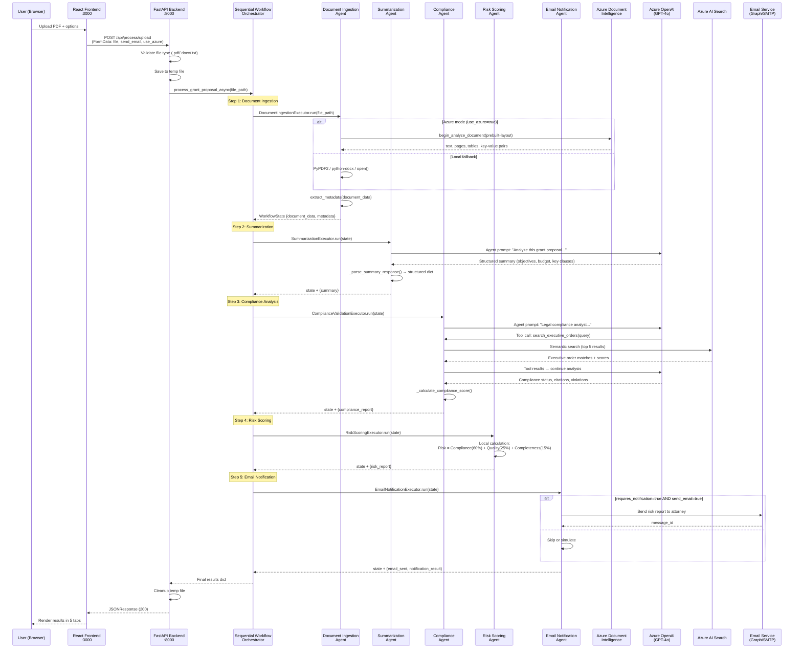
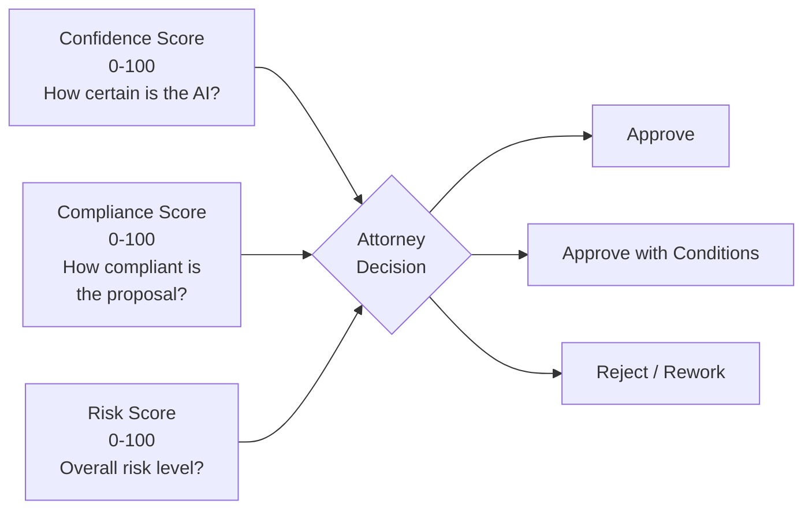
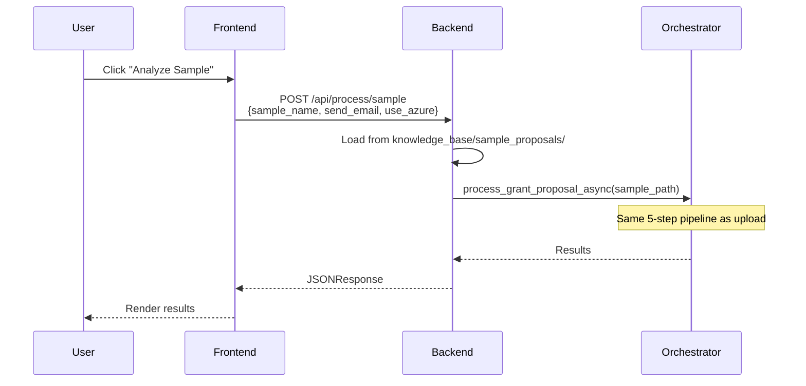
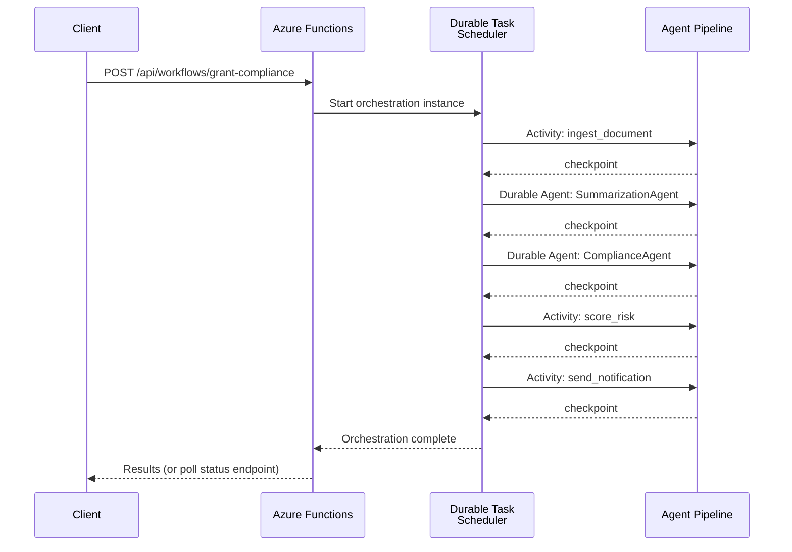
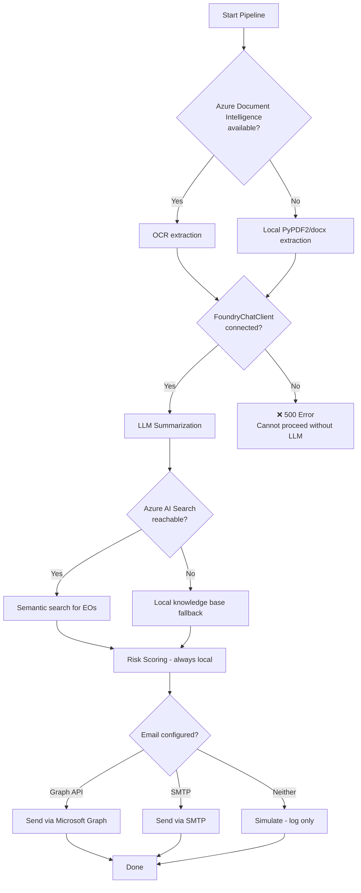

# End-to-End Workflow

> How a grant proposal moves through the system — from upload to attorney review.

---

## Quick Summary

A user uploads a PDF grant proposal → the system extracts text, summarizes it, checks compliance against executive orders, scores risk, and (optionally) emails an attorney — all in one request/response cycle.

```
User Upload → Document Ingestion → Summarization → Compliance Analysis → Risk Scoring → Notification
                   (OCR)              (LLM)            (LLM + Search)       (Local calc)     (Email)
```

---

## Sequence Diagram — Full Pipeline



---

## Data Transformation at Each Step

### Request Flow

| Step | Input | Output | Azure Service |
|------|-------|--------|---------------|
| **Frontend** | User selects file | `FormData {file, send_email, use_azure}` | — |
| **Backend** | FormData | `file_path` (temp file on disk) | — |
| **1. Ingestion** | `file_path` | `{text, page_count, word_count, metadata}` | Document Intelligence |
| **2. Summarization** | `document_data.text` + `metadata` | `{executive_summary, key_objectives, budget_highlights, key_clauses}` | Azure OpenAI |
| **3. Compliance** | `document_data.text` + `summary` | `{compliance_score, status, violations, citations, relevant_executive_orders}` | Azure OpenAI + AI Search |
| **4. Risk Scoring** | `compliance_report` + `summary` + `metadata` | `{overall_score, risk_level, risk_breakdown, recommendations}` | — (local) |
| **5. Notification** | `risk_report` + all prior state | `{email_sent, method, status}` | Graph API / SMTP |

### Response to Frontend

The final JSON response contains all accumulated state:

```json
{
  "status": "completed",
  "file_path": "proposal.pdf",
  "metadata": {
    "document_type": "grant_proposal",
    "word_count": 4500,
    "page_count": 12,
    "processing_timestamp": "2026-07-02T10:30:00Z"
  },
  "summary": {
    "executive_summary": "...",
    "key_objectives": ["..."],
    "budget_highlights": "...",
    "key_clauses": ["..."]
  },
  "compliance_report": {
    "compliance_score": 78.5,
    "overall_status": "requires_review",
    "confidence_score": 85.0,
    "violations": [{"message": "...", "executive_order": "EO 14091", "severity": "medium"}],
    "warnings": [...],
    "relevant_executive_orders": [...],
    "citations": [...]
  },
  "risk_report": {
    "overall_score": 72.0,
    "risk_level": "medium-high",
    "risk_breakdown": {
      "compliance_risk": {"score": 65, "factors": [...]},
      "quality_risk": {"score": 80, "factors": [...]},
      "completeness_risk": {"score": 85, "factors": [...]}
    },
    "recommendations": ["Address EO 14091 requirements...", "..."]
  },
  "email_sent": false,
  "overall_status": "requires_review"
}
```

---

## Scoring at a Glance

Three independent scores guide the attorney's decision:



| Score | Meaning | Calculated By |
|-------|---------|---------------|
| **Confidence** (0–100) | AI's certainty about its own analysis | LLM self-assessment during compliance step |
| **Compliance** (0–100) | How well the proposal aligns with executive orders | Rule-based from compliance status + keyword analysis |
| **Risk** (0–100) | Composite assessment (higher = lower risk) | Weighted formula: Compliance 60% + Quality 25% + Completeness 15% |

See [ScoringSystem.md](ScoringSystem.md) for full details.

---

## Alternative Entry Points

### Sample Document Processing



### Azure Functions (Durable) Hosting

When deployed as Azure Functions, each step becomes a durable activity/agent with automatic state persistence:



Key difference: Durable Functions **checkpoint after each step**, so failures resume from the last successful step rather than restarting.

---

## Error Handling & Fallbacks



**Critical dependency**: Azure OpenAI (LLM) is required for summarization and compliance analysis. If it's unreachable, the pipeline fails with a 500 error — which is the error you see when `AZURE_AI_FOUNDRY_PROJECT_ENDPOINT` is misconfigured or the service is down.

---

## Frontend Result Display

The React frontend renders results across 5 tabs:

| Tab | Shows | Source Field |
|-----|-------|-------------|
| **Overview** | Status, risk level, key metrics | `overall_status`, `risk_report.risk_level` |
| **Summary** | Executive summary, objectives, budget | `summary.*` |
| **Compliance** | Status, violations, citations, EO matches | `compliance_report.*` |
| **Risk** | Score breakdown, factors, recommendations | `risk_report.*` |
| **Email** | Notification status, preview | `email_sent`, `notification_result` |

---

## Environment Variables That Control Behavior

| Variable | Effect on Pipeline |
|----------|-------------------|
| `ORCHESTRATOR_TYPE=sequential` | Uses SequentialWorkflowOrchestrator (default) |
| `AGENT_SERVICE=agent-framework` | Uses Agent Framework + FoundryChatClient |
| `AGENT_SERVICE=foundry` | Uses Azure AI Foundry Prompt agents |
| `USE_AZURE=true` | Enables Document Intelligence for OCR |
| `USE_MANAGED_IDENTITY=true` | Authenticates via Managed Identity (not API keys) |
| `AI_SEARCH_QUERY_TYPE=semantic` | Semantic reranking on search queries |
